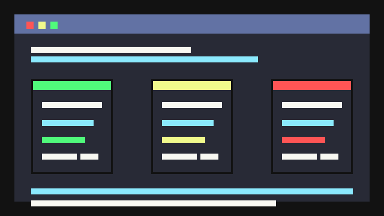

<sub>🌐 <b>中文</b> · <a href="README.en.md">English</a></sub>

<div align="center">

# CEO Prompt Builder

> *「别再让 Agent 猜你的需求。把粗糙想法编译成可执行规格。」*

[](SKILL.md)
[](https://skills.sh/owenchou95-svg/ceo-skill)
[](LICENSE)

**CEO 是一个可执行 Agent 规格编译器：它把模糊请求变成带 skill inventory 证据、边界条件、验证方法和输出契约的 Agent brief。**

[看效果](#效果示例) · [快速开始](#快速开始) · [触发方式](#触发方式) · [安全边界](#安全边界) · [验证](#验证)

</div>

---



<sub>演示使用静态 fixture 回放生成，不调用真实模型。可复现脚本见 [assets/showcase.tape](assets/showcase.tape)，无依赖 GIF 生成脚本见 [scripts/render_showcase_gif.py](scripts/render_showcase_gif.py)，演示讲解见 [assets/showcase.md](assets/showcase.md)。</sub>

---

## 它解决什么问题

事情是这样的：你给 Agent 一句“帮我做个高级网站”“审查这个 PR”“清掉生产数据再部署”，Agent 很容易直接开工，或者反复调用自己熟悉的那几个技能。

CEO 不做 prompt 润色。它先判断请求是能直接执行，还是必须澄清；再扫描本地安装的 skills/plugins；最后输出一个下游 Agent 可以照着执行的规格。规格里有目标、输入、范围、交付物、skill 选择证据、风险边界、验证方法和输出格式。

它特别适合技能很多、任务边界容易滑、你不想让 Agent 靠记忆猜路线的场景。

## 效果示例

| 输入类型 | CEO 判定 | 关键证据 | 示例 |
| --- | --- | --- | --- |
| 清晰文档编辑 | `Direct Path` | 简单 README 编辑不强行套技能，允许 `No special skill recommended` | [examples/direct-readme.md](examples/direct-readme.md) |
| 模糊产品/网站想法 | `Clarification Path` | `$office-hours` 排第一，先产出 `## Clarified Spec` | [examples/clarify-website.md](examples/clarify-website.md) |
| 高风险生产操作 | `Clarification Path` | 阻断删除/部署类不可逆动作，要求权限、目标和回滚边界 | [examples/high-risk-production.md](examples/high-risk-production.md) |

结果卡片：

- [assets/result-card.md](assets/result-card.md)：记录本轮打磨后的分数、鲁班体检和验证证据。

输出会包含这些固定段落：

1. `Triage`
2. `Skill Inventory Report`
3. `Skill Match`
4. `Conflicts / Choices` when needed
5. `Contract Check`
6. `Final Prompt`
7. `Assumptions`

`Final Prompt` 本身继续使用这些固定标题，方便下游 Agent 执行：

- `## Role`
- `## Objective`
- `## Requirements`
- `## Context`
- `## Thinking Process`
- `## Validation`
- `## Output Format`

## 快速开始

一行安装：

```bash
npx skills add owenchou95-svg/ceo-skill
```

如果你的 host 尚未支持 `npx skills add`，使用安全 clone 路线：

```bash
target="${CODEX_HOME:-$HOME/.codex}/skills/ceo"
test ! -e "$target" || { echo "Refusing to overwrite $target"; exit 1; }
mkdir -p "$(dirname "$target")"
git clone https://github.com/owenchou95-svg/ceo-skill.git "$target"
python3 "$target/scripts/verify_multi_agent_install.py"
```

装完对 Agent 说：

```text
$ceo 我想做一个更高级的个人网站，但还不确定风格、内容和要展示什么。请先判断是否需要澄清，再检索本地 skills/plugins，最后给我一个可执行 prompt。
```

更多安全安装、更新、卸载命令见 [docs/safe-install-uninstall.md](docs/safe-install-uninstall.md)。

## 触发方式

你可以这样用：

- `$ceo 把这个粗糙需求变成可执行 prompt`
- `$ceo 评估这个 prompt 是否真的可执行`
- `$ceo 我有个想法，但还没想清楚，请先判断要不要澄清`
- `$ceo 为这个前端原型任务选择合适的本地 skills 并写执行 prompt`
- `$ceo 这件事涉及部署和数据删除，请先写安全边界`
- `$ceo 基于这个 Clarified Spec 生成最终执行 prompt`
- `$ceo 检索我本地 skills/plugins，不要只凭记忆选技能`

不要用 CEO 来直接实现功能、做普通代码审查、安全审计、部署，或在你已经给出完整可执行规格且只想让 Agent 开工时绕一圈。

## 它会交付什么

CEO 交付的是一个可执行 brief，不是漂亮文案：

| 能力 | 交付物 | 为什么重要 |
| --- | --- | --- |
| 需求分流 | `Direct Path` / `Clarification Path` | 防止模糊或高风险任务被直接执行 |
| 技能检索 | `Skill Inventory Report` | 让 skill 选择可追溯，不靠模型记忆 |
| 技能选择 | `Skill Match` + finalist score | 比较多个候选，只保留强匹配和必要支持技能 |
| 规格契约 | `Final Prompt` | 下游 Agent 有目标、边界、交付物和验证方法 |
| 质量门 | `Contract Check` | 缺 inventory、缺验证、缺输出格式时不放行 |

## 它和普通 prompt 改写有什么不同

| 维度 | 普通 prompt 改写 | CEO Prompt Builder |
| --- | --- | --- |
| 起点 | 改得更顺、更完整 | 先判断能不能直接执行 |
| 技能选择 | 常靠模型记忆 | 先跑 `scripts/skill_inventory.py` 扫本地 metadata |
| 模糊需求 | 经常补假设后开工 | 路由到 `$office-hours` 产出 `## Clarified Spec` |
| 高风险任务 | 可能只写一句“小心” | 要求权限、边界、回滚和阻断条件 |
| 验证 | 常写“检查结果” | 按任务类型写具体测试、截图、命令、产物检查 |
| 可回归 | 难测 | 有 schema、fixtures、evaluator、contract drift check |

## 工作流

```text
Raw request
  -> Demand Triage
  -> Skill Inventory (frontmatter-only scan + cache)
  -> Candidate Ranking
  -> Finalist Reads (3-4 max)
  -> Skill Match
  -> Contract Check
  -> Final Prompt
  -> Evaluator
  -> SkillOpt benchmark
```

默认扫描这些根目录：

- `${CODEX_HOME:-$HOME/.codex}/skills`
- `${CODEX_HOME:-$HOME/.codex}/plugins/cache`
- `${AGENTS_HOME:-$HOME/.agents}/skills`
- `${CLAUDE_HOME:-$HOME/.claude}/skills`
- `${OPENCLAW_HOME:-$HOME/.openclaw}/skills`
- `${HERMES_HOME:-$HOME/.hermes}/skills`

默认召回 top 10；复杂任务扩展到 top 15；完整读取限制在最终 3-4 个 finalists。

## 安全边界

CEO 会做：

- 读取 skill frontmatter metadata，生成可追溯 inventory report。
- 在需求模糊、高风险、不可逆、缺少权限时走 clarification route。
- 把 material assumptions 写成边界、风险和可逆性。
- 要求下游 Agent 用命令、测试、截图、产物检查或引用证明完成。

CEO 不会做：

- 不直接实现功能或修改目标项目代码。
- 不替代 `$code-review`、`$security-review`、部署或数据库操作技能。
- 不在没有 inventory report 时猜测可用技能。
- 不替用户批准生产删除、部署、付款、法律/财务/安全类高风险动作。
- 不把弱匹配技能硬塞进 final prompt。

## 多 Agent 安装

仓库是 host-light 的：根协议在 [SKILL.md](SKILL.md)，辅助脚本是 Python 标准库，host-specific 说明在 [adapters/](adapters/)。

| Host | Install Root | Adapter |
| --- | --- | --- |
| Codex | `${CODEX_HOME:-$HOME/.codex}/skills/ceo` | root `SKILL.md` |
| Claude Code | `${CLAUDE_HOME:-$HOME/.claude}/skills/ceo` | [adapters/claude-code.md](adapters/claude-code.md) |
| OpenClaw | `${OPENCLAW_HOME:-$HOME/.openclaw}/skills/ceo` | [adapters/openclaw.md](adapters/openclaw.md) |
| Hermes | `${HERMES_HOME:-$HOME/.hermes}/skills/ceo` | [adapters/hermes.md](adapters/hermes.md) |

详细说明见 [docs/multi-agent-usage.md](docs/multi-agent-usage.md)。

## 验证

从仓库根目录运行：

```bash
python3 -m unittest discover -s scripts -p 'test_*.py'
python3 scripts/validate_contract_drift.py
python3 scripts/validate_eval_fixtures.py references/eval-fixtures.json
python3 scripts/verify_multi_agent_install.py
python3 scripts/smoke_host_native_cli.py
python3 scripts/render_showcase_gif.py
```

验证 skill 结构：

```bash
python3 "${CODEX_HOME:-$HOME/.codex}/skills/.system/skill-creator/scripts/quick_validate.py" "${CODEX_HOME:-$HOME/.codex}/skills/ceo"
```

跑一个 inventory 示例：

```bash
python3 scripts/skill_inventory.py \
  --request "我想做一个产品但不确定是否值得做，请帮我想清楚方向和范围。" \
  --triage clarification \
  --format markdown
```

评估生成的 CEO 输出：

```bash
python3 scripts/evaluate_ceo_output.py --request "<raw user request>" path/to/ceo-output.md
```

## 文件结构

```text
.
├── SKILL.md
├── README.md
├── README.en.md
├── examples/
│   ├── direct-readme.md
│   ├── clarify-website.md
│   └── high-risk-production.md
├── assets/
│   ├── showcase.md
│   ├── showcase.tape
│   ├── showcase.gif
│   └── result-card.md
├── adapters/
│   ├── claude-code.md
│   ├── hermes.md
│   └── openclaw.md
├── docs/
├── references/
├── schema/
└── scripts/
```

## 当前优化状态

已落地的 P0/P1 能力：

- request-aware demand-triage evaluation
- executable positive/negative fixture tests
- `$office-hours` synchronization in SkillOpt
- coverage-aware skill finalists
- single-critical-gap clarification rule
- clarified-spec readiness checks
- alias/canonical-family handling for duplicate skill families
- stream-based frontmatter parsing
- public examples and reproducible showcase assets
- release templates, issue templates, and a public result card

当前实测结果：

- 技能本体评分：`90 -> 95 / 100`
- 公开发布就绪度：`76 -> 95 / 100`
- 鲁班出生证：`8 PASS / 5 WARN / 0 FAIL -> 14 PASS / 0 WARN / 0 FAIL`

已知边界：

- `scripts/verify_multi_agent_install.py` 验证模拟布局与 helper execution；真实 host-native dispatch 需要 `scripts/smoke_host_native_cli.py` 和本机 host CLI。
- `scripts/run_live_model_samples.py` 支持 fixture/historical output validation；真实 live-model generation 需要配置本地 `CEO_LIVE_MODEL_COMMAND` 与凭据，不作为默认 CI hard gate。

## 致谢

CEO 的结构受到 Agent Skills 生态、Codex skills、SkillOpt 风格评测、prompt evaluation 工作流启发。方法论来源与对标记录见 [docs/ceo-three-hour-review-20260608.md](docs/ceo-three-hour-review-20260608.md)。

## License

[MIT](LICENSE)
